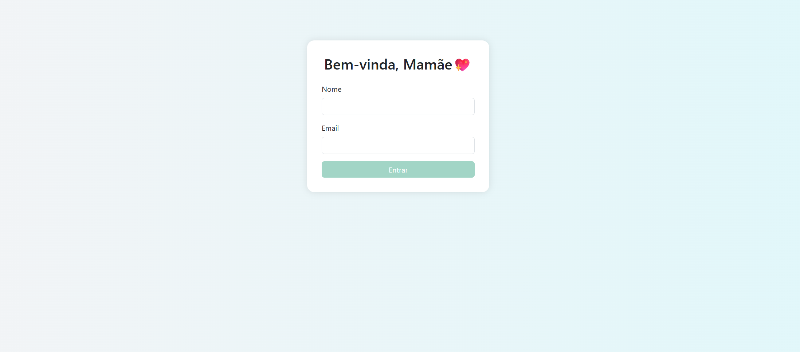
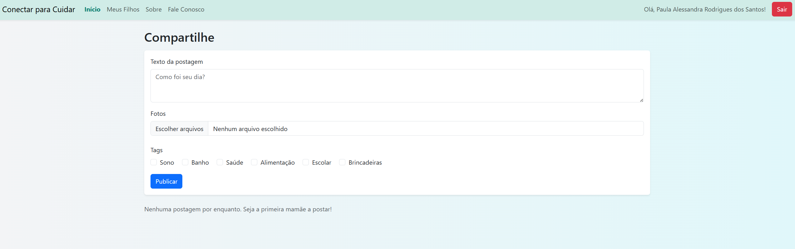
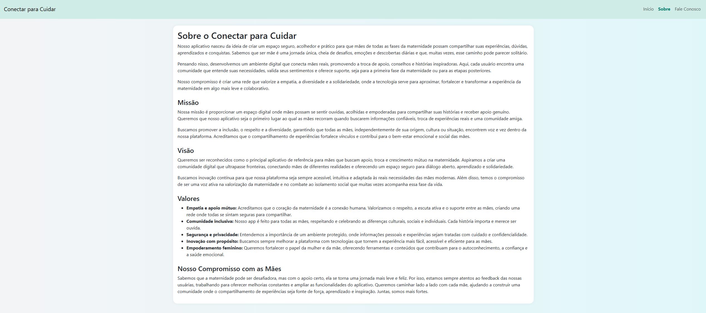
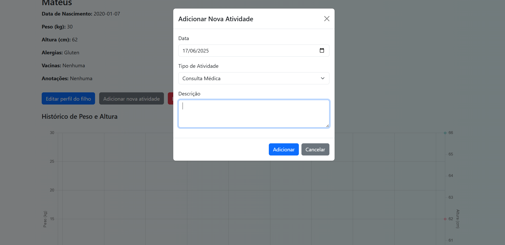

# 👶 Conectar para Cuidar - Protótipo de Aplicativo para Cuidado Infantil

Bem-vindo ao repositório do **Conectar para Cuidar**, um protótipo de aplicativo web dedicado a auxiliar pais e responsáveis no cuidado e acompanhamento do desenvolvimento de seus filhos. Este projeto foca na experiência do usuário, oferecendo um ambiente intuitivo para registro de informações, atividades e interação.

<br>

🚀 Sobre o Projeto

O Conectar para Cuidar é um protótipo de aplicativo front-end, desenvolvido com HTML, CSS e JavaScript, que simula as principais funcionalidades de uma plataforma de apoio à maternidade/paternidade. Embora seja um protótipo (sem backend funcional), ele demonstra a estrutura e o design de um aplicativo que permitiria aos usuários registrar perfis de filhos, postar atualizações, gerenciar atividades e interagir com uma comunidade. O foco principal foi a criação de uma interface amigável e responsiva.

<br>

⚙️ Funcionalidades (Protótipo)

*   **Login/Registro:** Simulação de um fluxo de autenticação para acesso ao aplicativo, com persistência de dados básicos via `localStorage`.
*   **Página Inicial (Home):** Um feed para postagens e atualizações, simulando a interação social.
*   **Registro de Perfil dos Filhos:** Funcionalidade para adicionar e gerenciar perfis individuais de cada criança, incluindo informações básicas.
*   **Registro de Atividades:** Capacidade de registrar e acompanhar as atividades diárias dos filhos (ex: alimentação, sono, brincadeiras).
*   **Modais Interativos:** Utilização de modais para diversas interações, como formulários de registro ou detalhes de atividades.
*   **Página "Sobre":** Detalhes sobre a missão, visão e valores do aplicativo, explicando seu propósito.
*   **Página "Fale Conosco":** Um canal para que os usuários possam entrar em contato e enviar feedback.
*   **Navegação Intuitiva:** Estrutura de navegação clara e fácil de usar, garantindo uma boa experiência.

<br>

📦 Tecnologias Utilizadas

*   **HTML5:** Estruturação semântica e base de todo o conteúdo do aplicativo.
*   **CSS3:** Estilização completa da interface, incluindo layout responsivo para diferentes dispositivos e elementos visuais atraentes.
*   **JavaScript:** Lógica de interação do protótipo, manipulação do DOM, controle de modais, simulação de login e persistência de dados no `localStorage`.
*   **Bootstrap 5:** Framework CSS para agilizar o desenvolvimento do layout e garantir a responsividade e componentes pré-estilizados.

<br>

🖼️ Como ficou

**Página de Login**

_A tela inicial de acesso ao aplicativo._

<br>

**Página Inicial (Home)**

_Exemplo do feed de postagens e atividades._

<br>

**Página "Sobre"**

_Visão geral da seção que detalha o propósito do aplicativo._

<br>

**Modal de Registro/Atividade**

_Exemplo de um modal sendo utilizado para interação._

<br>

📂 Como Executar o Projeto

1.  **Clone o repositório:**
    ```bash
    git clone https://github.com/paulaalessandrars/conectar-para-cuidar-app.git
    ```
2.  **Navegue até a pasta do projeto:**
    ```bash
    cd conectar-para-cuidar-app
    ```
3.  **Abra o arquivo `index.html` no seu navegador favorito** e explore o protótipo do aplicativo!

<br>

🤝 Contribuição

Contribuições são muito bem-vindas! Se você deseja aprimorar este protótipo, adicionar novas funcionalidades ou corrigir bugs, sinta-se à vontade para fazer um fork deste repositório, criar uma nova branch e enviar um pull request.

1.  Faça um fork do projeto.
2.  Crie uma nova branch:
    ```bash
    git checkout -b minha-nova-feature
    ```
3.  Faça suas alterações e faça o commit:
    ```bash
    git commit -m 'Adiciona minha nova feature'
    ```
4.  Envie para o repositório original:
    ```bash
    git push origin minha-nova-feature
    ```
5.  Abra um Pull Request para análise.

<br>

🤩 Por que este protótipo é tão legal?
*   **Impacto Social:** Aborda uma necessidade real de apoio e organização para pais e responsáveis no cuidado infantil.
*   **Demonstração de Habilidades Front-end:** Apresenta um projeto completo utilizando HTML, CSS e JavaScript, com foco em usabilidade e design responsivo.
*   **Potencial de Expansão:** Sendo um protótipo, oferece uma base sólida para futuras implementações de backend e funcionalidades mais complexas.
*   **Interface Amigável:** Design pensado para ser intuitivo e acolhedor, refletindo o propósito do aplicativo.

<br>

Curtiu? Dá aquele ⭐ no repositório e vamos criar algo incrível juntos!

<br>

🚀 Mantenha-se conectado! Fique de olho nos updates e novas funcionalidades que estão por vir.

